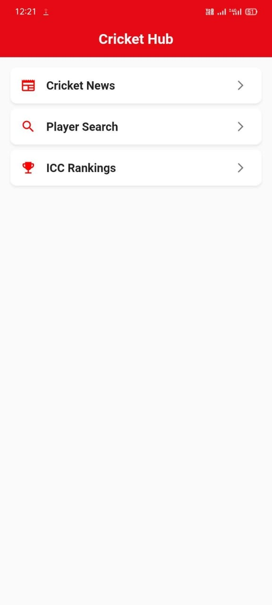
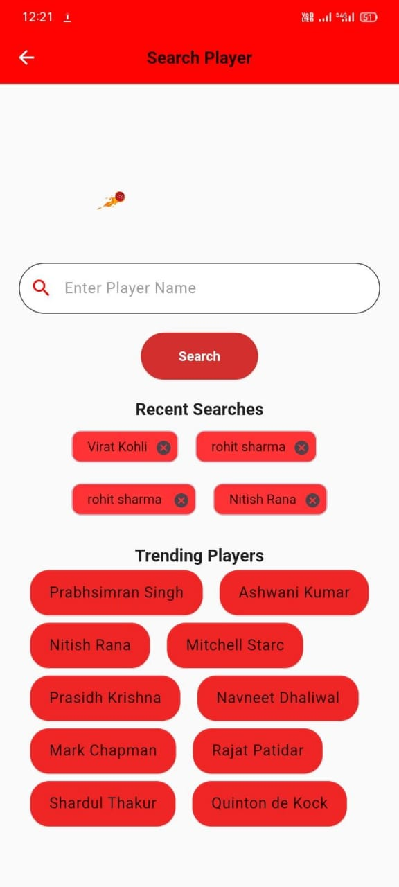
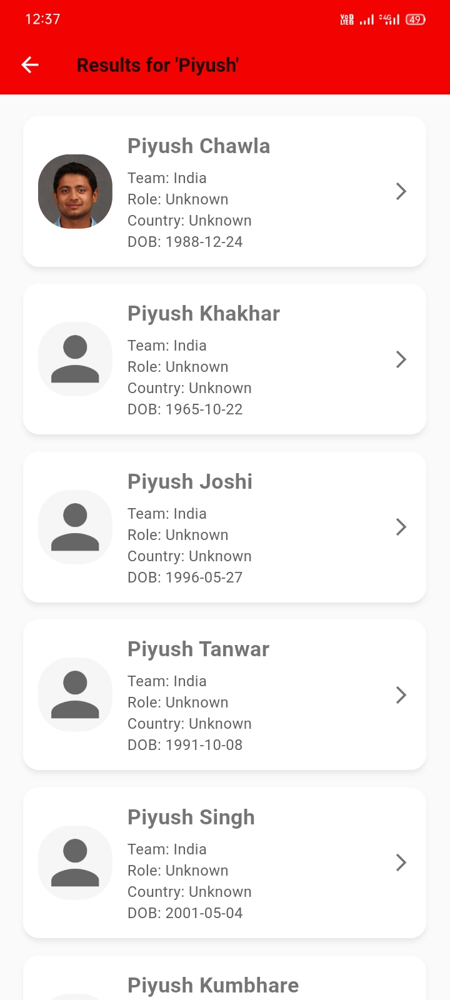
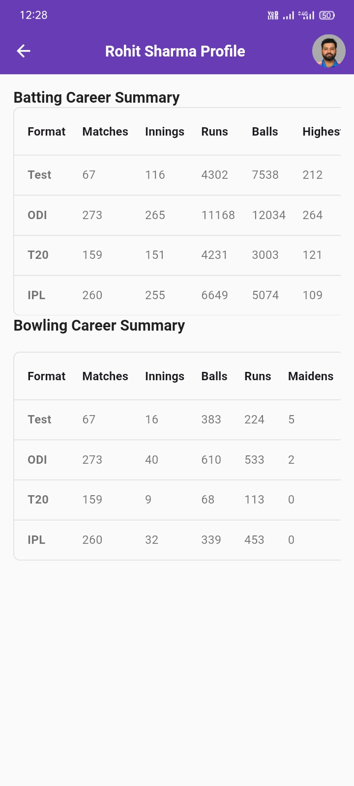
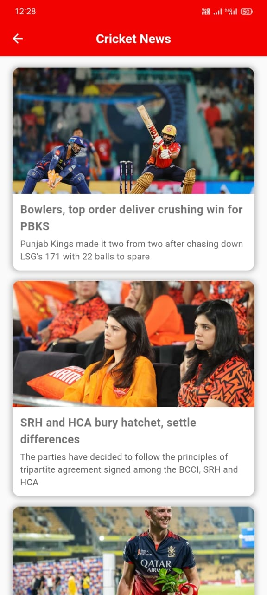
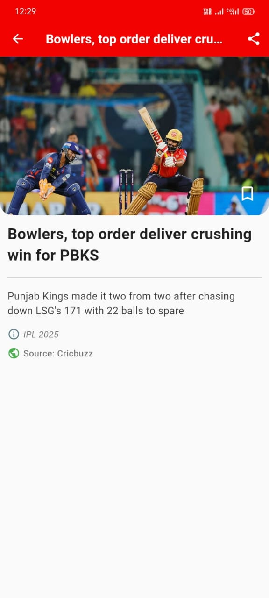
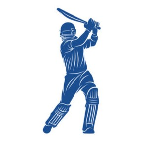

# 🏏 Cricket Stats & News App

## 📌 Overview

This is a **Flutter-based Cricket App** that provides **real-time cricket player statistics, news, and ICC rankings** using APIs. The app is built with **Provider for state management** and **Flutter Cache Manager for caching API responses**, ensuring a **smooth, fast, and efficient user experience**.

---

## 🚀 Features

✅ **Player Search:** Search for cricket players and retrieve their detailed statistics.  
✅ **Player Statistics:** Displays career stats, batting & bowling averages, and recent performances.  
✅ **Cricket News:** Fetches and displays the latest cricket news articles.  
✅ **ICC Rankings:** Shows rankings for **Batsmen, Bowlers, All-rounders, and Teams**.  
✅ **Cached API Responses:** Uses Flutter Cache Manager to store API responses and images locally for faster loading.  
✅ **State Management with Provider:** Ensures **reactive UI updates** when data changes.  
✅ **Shimmer Loading Effects:** Displays loading placeholders while fetching data.  
✅ **Responsive UI:** Optimized for **mobile devices with smooth navigation**.  
✅ **Adaptive UI Design:** Supports both **light and dark themes** (upcoming feature).  
✅ **Fast & Secure API Calls:** Uses efficient network handling to reduce load times.  

---

## 📱 Screens Overview

### 🏠 **Home Screen**
- Provides navigation to **News, Rankings, Search, and Player Stats** sections.



### 🔍 **Player Search Screen**
- Allows users to search for a player by name and view matching results.

  

### 📊 **Player Statistics Screen**
- Displays detailed **batting, bowling, and career stats** across different formats.



### 📰 **Cricket News Screen**
- Fetches and displays the **latest cricket news with images and headlines**.

  

### 🏆 **ICC Rankings Screen**
- Displays official **ICC rankings for Batsmen, Bowlers, All-rounders, and Teams**.


---

## 📽️ App Demonstration

Check out the full **video demo** showcasing the working of all screens:

[](outputs/demo.mp4)

---

## 🛠️ Technologies & Packages Used

📌 **Flutter** (Latest Stable Version)  
📌 **Provider** (For state management)  
📌 **Flutter Cache Manager** (For caching API responses and images)  
📌 **HTTP** (For API calls)  
📌 **Shimmer** (For loading animations)  
📌 **Material UI Components** (For an intuitive user interface)  

---

## 🌍 APIs Used

🔹 **Rapid API - Cricbuzz API Endpoints:**

- **Fetch ICC Rankings:**
  ```sh
  https://cricbuzz-cricket.p.rapidapi.com/stats/v1/rankings/{bowler, batsman, allrounders, teams}?formatType=${formates[i]}
  ```
- **Fetch Player Image by Image ID:**
  ```sh
  https://cricbuzz-cricket.p.rapidapi.com/img/v1/i1/c$imageId/i.jpg?p=de
  ```
- **Fetch Trending News:**
  ```sh
  https://cricbuzz-cricket.p.rapidapi.com/news/v1/index
  ```
- **Fetch Trending Players:**
  ```sh
  https://cricbuzz-cricket.p.rapidapi.com/stats/v1/player/trending
  ```
- **Search Players by Name:**
  ```sh
  https://cricbuzz-cricket.p.rapidapi.com/stats/v1/player/search?plrN=$playerName
  ```
- **Fetch Player Stats (Batting & Bowling):**
  ```sh
  https://cricbuzz-cricket.p.rapidapi.com/stats/v1/player/${playerID}/${type}
  ```

---

## ⚡ Installation Guide

1️⃣ Clone the repository:
   ```sh
   git clone https://github.com/Piyush1716/cricket-app.git
   ```
2️⃣ Navigate to the project directory:
   ```sh
   cd cricket-app
   ```
3️⃣ Install dependencies:
   ```sh
   flutter pub get
   ```
4️⃣ Run the app:
   ```sh
   flutter run
   ```

---

## 🔮 Future Improvements

🔹 **Dark Mode Support** 🌙  
🔹 **Favorite Players Feature** ⭐  
🔹 **Push Notifications for Live Matches and Updates** 🔔  
🔹 **Offline Mode using Local Storage** 📶  
🔹 **Integrate More APIs for Comprehensive Stats** 📊  
🔹 **Live Match Scores & Commentary** 🏏  
🔹 **Match Schedule & Upcoming Fixtures** 📅  
🔹 **User Authentication for Personalized Experience** 🔑  

---

## 🤝 Contribution

Contributions are welcome! 🎉 Feel free to **fork the repo**, submit pull requests, or report issues.

---

## 📜 License

This project is licensed under the **MIT License** - see the [LICENSE](LICENSE) file for details.

---

**🌟 If you like this project, don't forget to star ⭐ the repository!**

